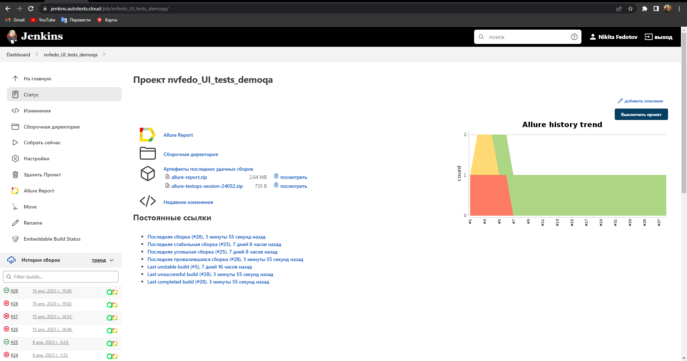
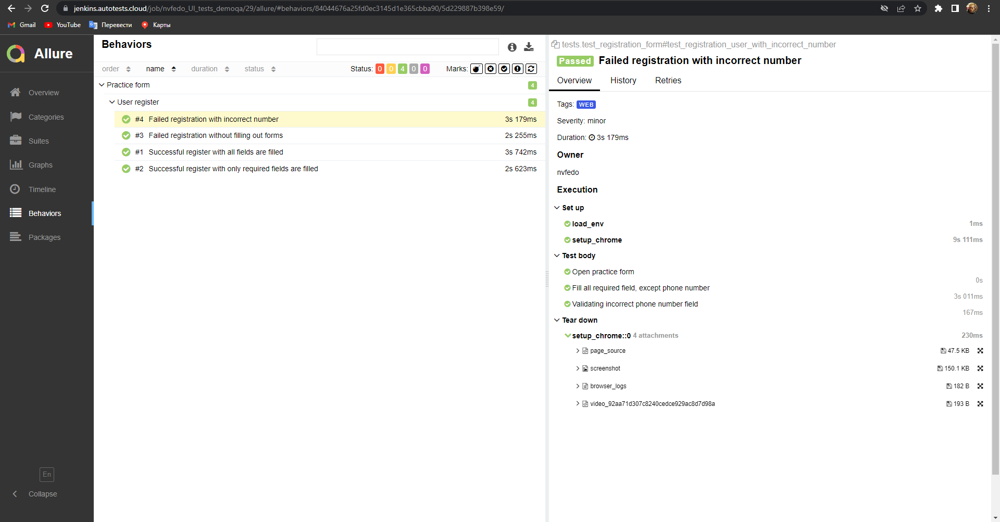
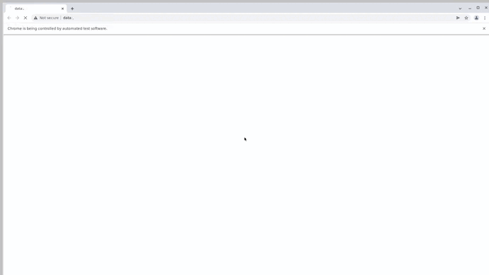

<h2 align="center">Autotest UI project for demoqa.com</h2>

### Stack and tools

  <code></code>
  <code></code>
  <code></code>
  <code></code>
  <code></code>
  <code></code>
  <code></code>
  <code></code>
  <code></code>
  <code></code>

### What does the test do:
- [x] Fills in the fields of the registration form. Elements such as checkbox, datepicker, dropdown, radiobutton and others are used
- [x] Submit filled fields
- [x] Validation filled fields

###  Project in Jenkins

### [Job](https://jenkins.autotests.cloud/job/nvfedo_UI_tests_demoqa/)

#### Just click "Build Now" and the tests will start building and passing them through the virtual machine

###  Allure report

#### After passing the tests, the results are recorded in the Allure report. Tests have attachments such as screenshot, video, page_source and browser log.

#### Test video

###  Integration with Allure TestOps is also configured. After running a job from Jenkins, a run is automatically created in Allura.

