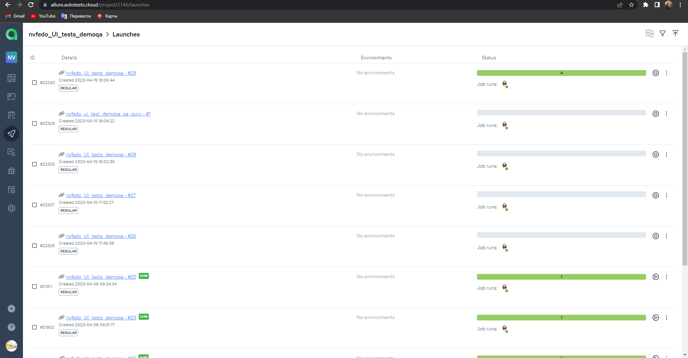
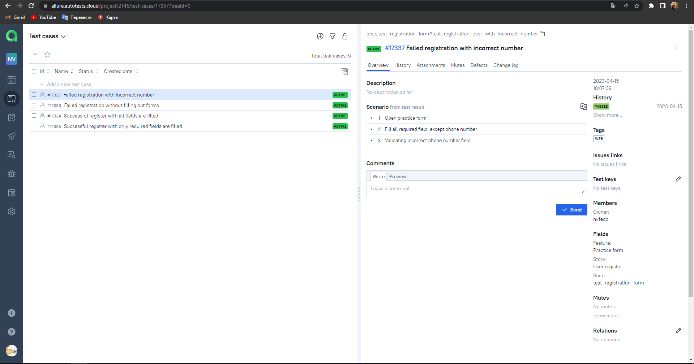
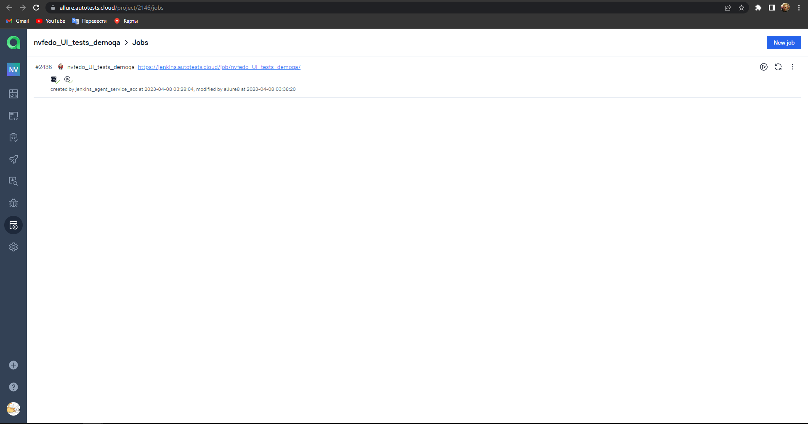
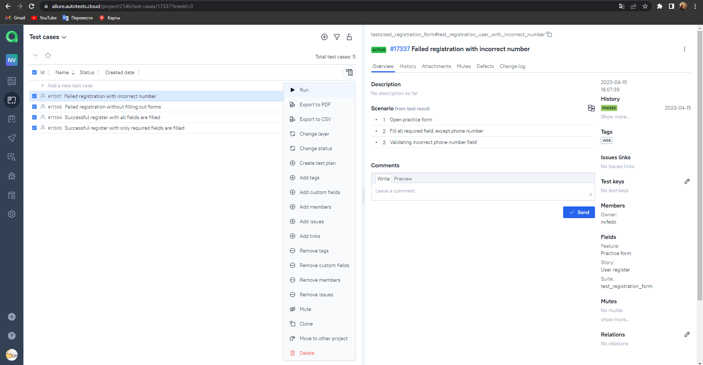
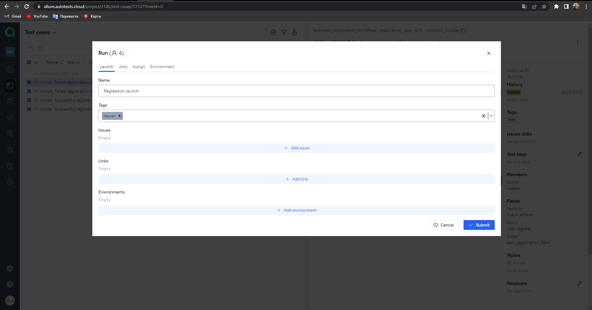
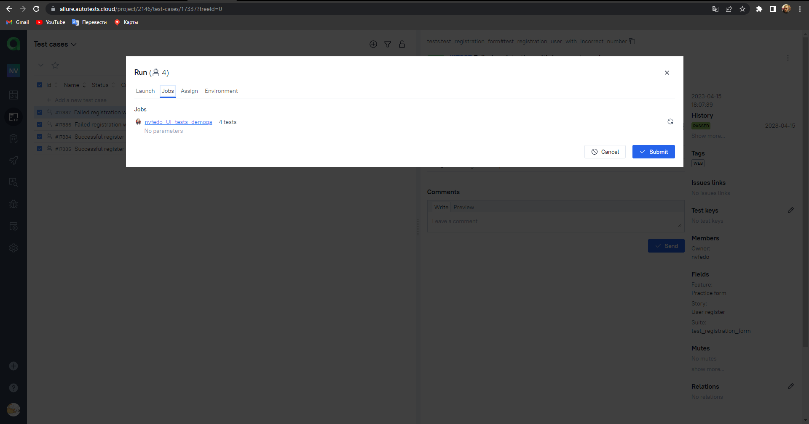
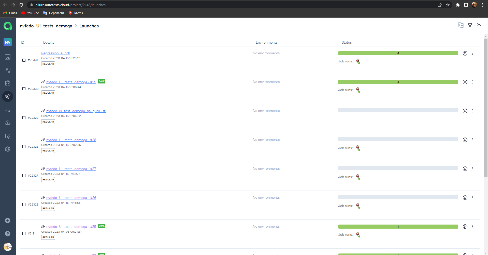
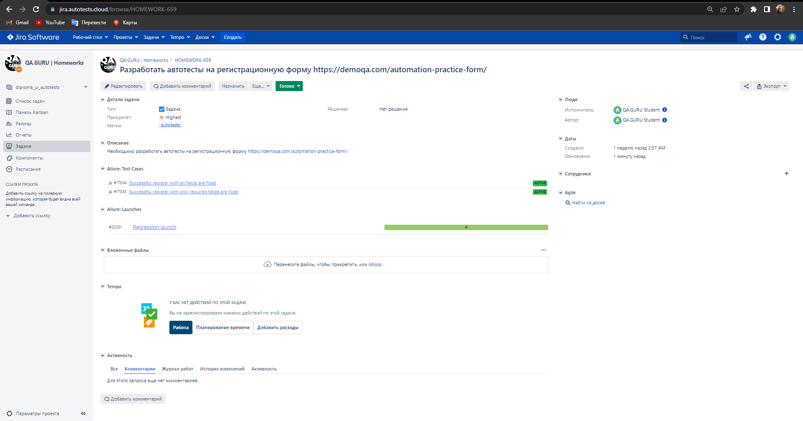
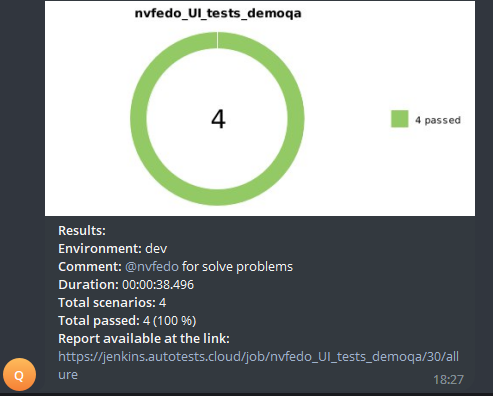

<h2 align="center">Autotest UI project for demoqa.com</h2>

<h2 align="center">Stack and tools</h2>

  <code></code>
  <code></code>
  <code></code>
  <code></code>
  <code></code>
  <code></code>
  <code></code>
  <code></code>
  <code></code>
  <code></code>
    <code></code>

### What does the test do:
- [x] Fills in the fields of the registration form. Elements such as checkbox, datepicker, dropdown, radiobutton and others are used
- [x] Submit filled fields
- [x] Validation filled fields
- [x] Validation empty fields

###  Project in Jenkins

### [Job](https://jenkins.autotests.cloud/job/nvfedo_UI_tests_demoqa/)

#### Just click "Build Now" and the tests will start building and passing them through the virtual machine.

###  Allure report

#### After passing the tests, the results are recorded in the Allure report. Tests have attachments such as screenshot, video, page_source and browser log.

#### Test video

###  Allure TestOps

Integration with Allure TestOps is also configured. After running a job from Jenkins, a launch is automatically created in Allure TestOps.
For example, this launch was created at the same time as the launch of the job from Jenkins.

Test cases automatically created when you are finish the launch

It is also possible to select the necessary ones from the test cases tab and run the launch with them (without visiting Jenkins):
Ready and configured job

Select testcases and click "Run" throught bulk actions in Allure TestOps and in "Job" and make sure that the job from the previous step is selected as active

Launch successfully start. In the "Launches" tab new created launch appeared

###  Jira 
Integration with bug tracking system Jira has been set up, allowing you to link launches and test cases to tasks.

###  Telegram
Configured a telegram bot that sends a notification with a report after completing a job from Jenkins.

